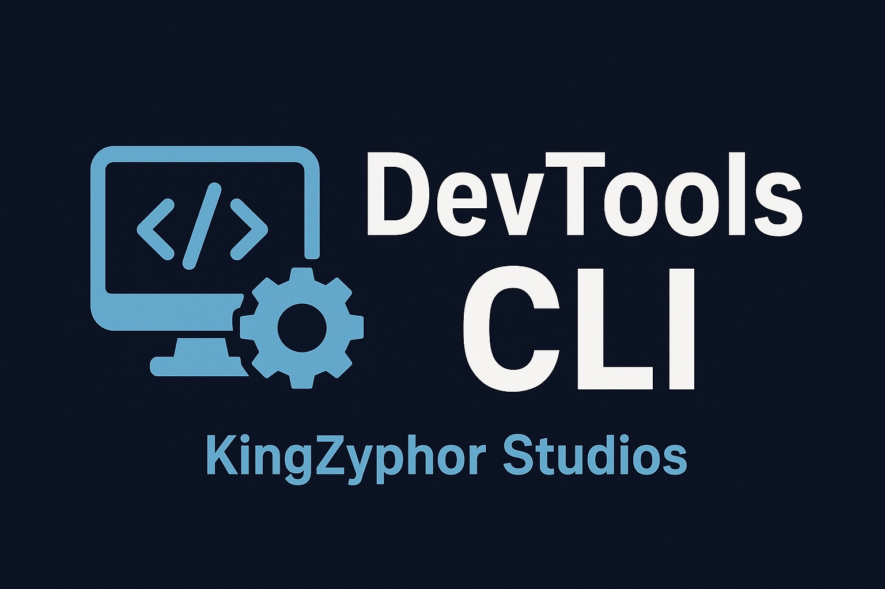

<p align="center">
<a href="https://www.npmjs.com/package/@kingzyphor/devtools-cli"><strong>NPM Package</strong></a> •
<a href="https://github.com/KingZyphor/devtools-cli/blob/main/CONTRIBUTING.md"><strong>Contributing</strong></a> •
<a href="https://discord.gg/85SKNqWQq2"><strong>Discord</strong></a> •
<a href="https://github.com/KingZyphor/devtools-cli/discussions"><strong>Ask a question</strong></a>
</p>

<p align="center">
Part of the <strong>KingZyphor Tools</strong> Project
</p>

<p align="center">
<a href="https://www.npmjs.com/package/@kingzyphor/devtools-cli"></a>
<a href="https://github.com/KingZyphor/devtools-cli/actions/workflows/test.yml"></a>
<a href="https://github.com/KingZyphor/devtools-cli/blob/main/LICENSE"></a>
<a href="https://nodejs.org/"></a>
<a href="https://discord.gg/85SKNqWQq2"></a>
</p>

## About

> Tired of repetitive Git commands, messy repos, or debugging headaches?  
> **DevTools CLI** is here to help streamline your workflow!

`DevTools CLI` is a **cross-platform, bash-first toolkit** for repository maintenance, debugging, and automation. It provides a compact, production-ready set of shell scripts usable via `devtools` or the alias `dt`.

**Key Features:**

* Safe, automated Git operations (`git-autopush`, `branch-sync`)  
* Debug suite for dependencies, logs, and processes  
* System and environment diagnostics (`sys-info`)  
* Repository cleaning with dry-run mode (`repo-cleaner`)  
* Modular, safe scripts for real-world usage  
* Cross-platform: Linux, macOS, Windows (Git Bash/WSL)  

---

## 🚀 Usage

<details>
<summary><strong>Available Commands</strong></summary>

| Command        | Description                                                      |
|----------------|------------------------------------------------------------------|
| `git-autopush` | Safe automated `git add`, `commit`, and `push`                  |
| `debug-suite`  | Logs, ports, dependency checks, process inspection              |
| `sys-info`     | System and environment diagnostics                               |
| `repo-cleaner` | Conservative repository organizer (dry-run by default)          |
| `branch-sync`  | Safe branch synchronization                                      |
| `error-trace`  | Collect traces for PIDs or run commands under trace             |

</details>

### Examples

```bash
# Git autopush
npx devtools git-autopush -b main -m "chore: update"

# Debug dependencies
npx devtools debug-suite deps

# Dry-run repo cleaning
npx dt repo-cleaner --dry-run

# System info check
npx devtools sys-info
```

## 💡 Notes & Tips

- **Alias:** `dt` works interchangeably with `devtools`  
- **Modular & Safe:** Scripts designed for real-world usage  
- **Cross-Platform:** Linux, macOS, Windows (via Git Bash or WSL)  
- **Ownership:** KingZyphor retains full rights to the CLI and derivatives  

---

## 💭 Feedback & Contributions

> Found this CLI helpful? Want to suggest new commands? Open source is all about collaboration.

You can contribute by:

- 📝 **Opening issues** for bugs or feature requests  
- 💻 **Submitting pull requests** with improvements  
- 🌐 **Translating or documenting commands**  

---

## 📖 Further Reading

- [NPM Package](https://www.npmjs.com/package/@kingzyphor/devtools-cli)  
- [GitHub Repository](https://github.com/KingZyphor/devtools-cli)  
- [License](https://github.com/KingZyphor/devtools-cli/blob/main/LICENSE)  

---


## 📝 License

This is free tool: you can redistribute it and/or modify it under the terms of the **MIT License**.  
A copy of this license is provided in [`LICENSE`](https://github.com/KingZyphor/devtools-cli/blob/main/License.md)